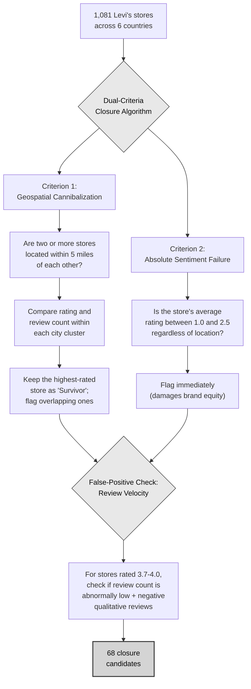
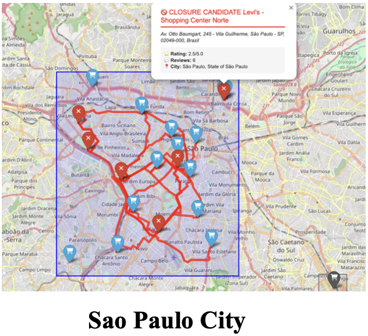
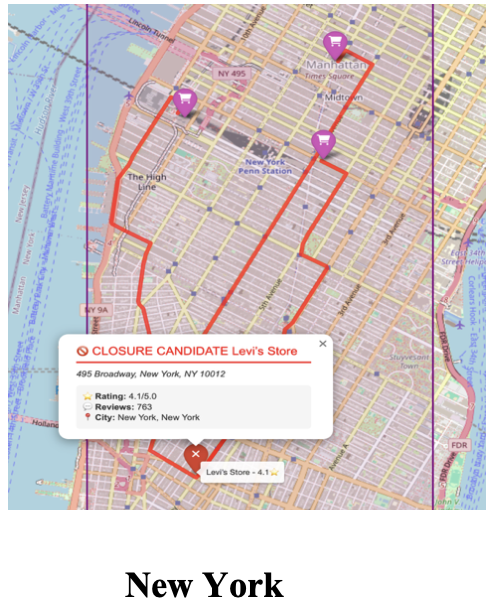
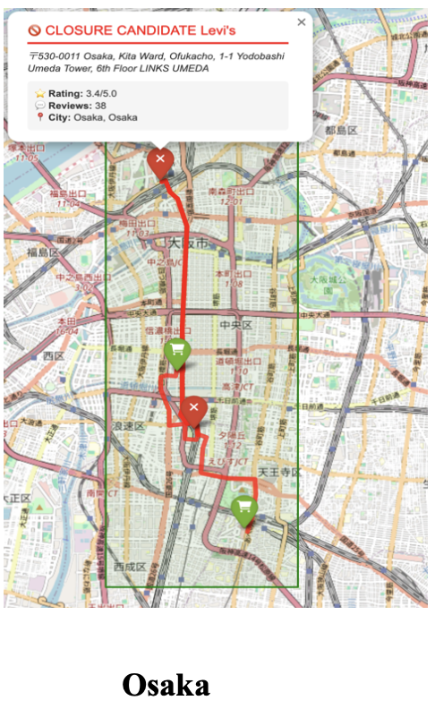
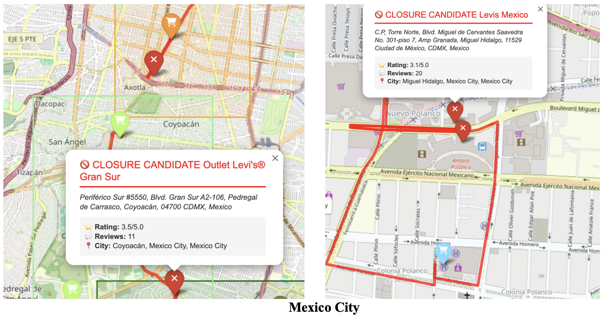
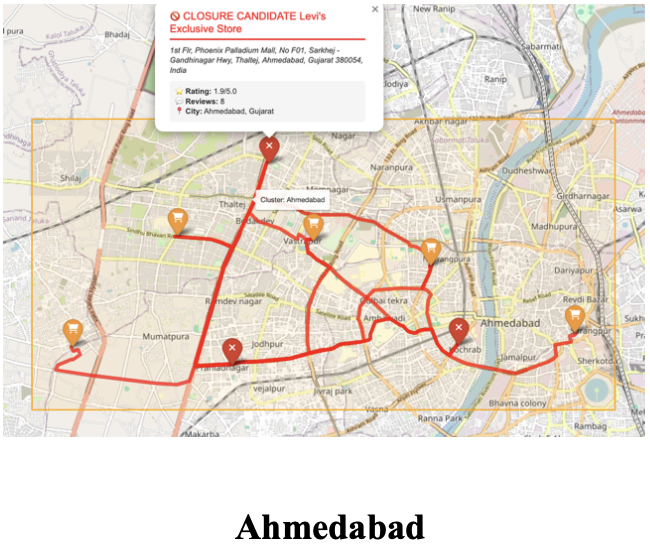
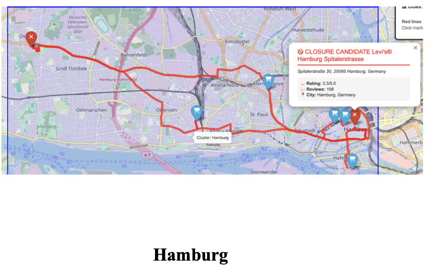
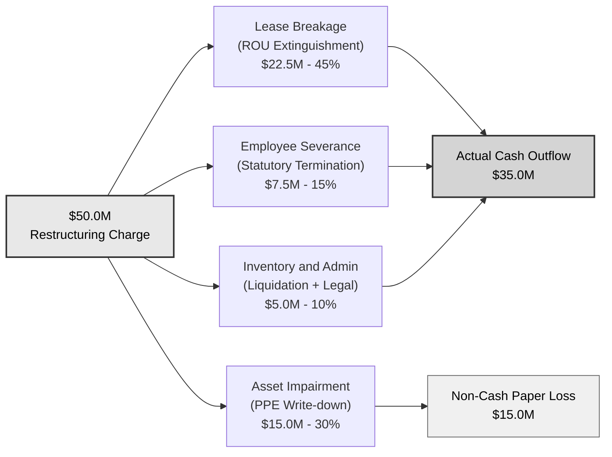
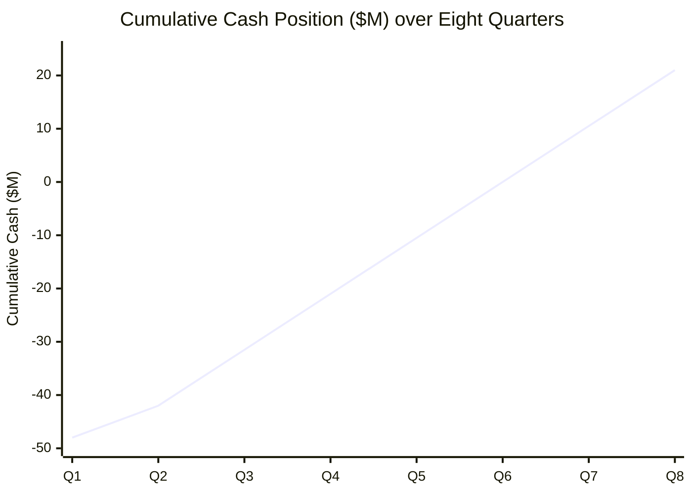

# Levi Strauss & Co. — Portfolio Rationalization Study


<p align="center">

<!-- Technical Skills -->


<br/>

<!-- Business & Strategy Skills -->


</p>

Levi Strauss & Co. spends over 50 cents in operating costs for every dollar it earns, and the
number keeps rising. The main driver is a growing physical store network where nearby stores
share the same customers but each still pays full rent, payroll, and utilities.

This project identifies which stores are causing that overlap, models the cost of closing them,
and shows that a $50M restructuring investment recovers itself in roughly 15 months while
permanently reducing annual operating expenses by $42M.

---

## Table of Contents

- [What This Project Does](#what-this-project-does)
- [Background](#background)
- [The Problem](#the-problem)
- [The Hypothesis](#the-hypothesis)
- [Industry Validation: The Starbucks Precedent](#industry-validation-the-starbucks-precedent)
- [Data and Methodology](#data-and-methodology)
- [The Dual-Criteria Closure Algorithm](#the-dual-criteria-closure-algorithm)
- [Results](#results)
- [Capital Allocation](#capital-allocation)
- [The Four Pillars of the Restructuring Charge](#the-four-pillars-of-the-restructuring-charge)
- [Financial Impact](#financial-impact)
- [Strategic Recommendations](#strategic-recommendations)
- [Repository Structure](#repository-structure)
- [How to Reproduce](#how-to-reproduce)
- [Team](#team)
- [References](#references)

---

## What This Project Does

This study answers a single question:

> *If Levi Strauss & Co. spends fifty million dollars to close its worst-performing physical stores, will the company make that money back, and how soon?*

To answer the question, the team scraped public Google Maps data for 1,081 Levi's stores across six countries(United States, India, Brazil, Japan, Mexico, and Germany) , ranked each store using customer reviews and ratings as proxies for foot traffic and service quality, and identified 68 stores whose closure would permanently reduce fixed costs. The resulting financial model projects an annual cost saving of forty-two million dollars and a payback period of approximately fifteen months.

The project consists of three deliverables stored in this repository:

1. A written report, [`Report.pdf`](Report.pdf), explaining the full business case in 32 pages.
2. A Jupyter notebook, [`Levi's Case Study Python code.ipynb`](Levi's%20Case%20Study%20Python%20code.ipynb), containing the end-to-end analysis.
3. Seven interactive HTML maps in the [`Countries Map with stores/`](Countries%20Map%20with%20stores/) folder showing every closure candidate plotted on its city map.

---

## Background

Levi Strauss & Co. was founded in San Francisco in 1853 and is one of the oldest apparel companies in the world. As of fiscal year 2025, the company sells its products in approximately 120 countries through roughly 50,000 retail touchpoints and 3,300 brand-dedicated stores. Its stated long-term goal is to become a ten-billion-dollar revenue company at a fifteen-percent EBIT margin.

The company operates through two revenue channels. The first is Direct-to-Consumer (DTC), which includes its own retail stores and e-commerce platform; this channel grew eleven percent in fiscal year 2025. The second is Wholesale, which sells to department stores and other retail partners; this channel declined three percent in 2024.

### Revenue Performance, FY 2024 to FY 2025

| Metric | FY 2024 | FY 2025 | Change |
| --- | --- | --- | --- |
| Net Revenue | $6,032M | $6,282M | +4.1% |
| Americas | $3,200.6M | $3,297.0M | +3.0% |
| Europe | $1,617.9M | $1,699.3M | +5.0% |
| Asia | $1,082.4M | $1,134.4M | +4.8% |
| Beyond Yoga | $131.1M | $151.3M | +15.4% |
| Gross Profit | $3,657.1M | $3,877.8M | +6.0% |
| Gross Margin | 60.6% | 61.7% | +110 bps |

Source: Levi Strauss & Co. FY 2024 and FY 2025 10-K filings.

---

## The Problem

Although revenue grew 4.1 percent in fiscal year 2025, profitability did not improve at the same pace. The reason is that Selling, General, and Administrative (SG&A) expenses remain structurally high, consuming roughly half of every dollar of revenue the company earns. The cost of operating physical stores, including rent, payroll, and distribution, continues to expand alongside the store footprint, but the additional revenue generated by each new store is not large enough to offset the additional cost.

Levi's own fiscal year 2025 10-K filing, on page 54, states the cause directly: *"selling expenses increased due to higher DTC store expenses, including from store expansion."*

### The SG&A Trend Across Three Reporting Periods

| Metric | FY 2024 (10-K) | FY 2025 (10-K) | Q1 FY 2026 (10-Q) |
| --- | --- | --- | --- |
| SG&A Expense | $3,091.9M | $3,173.2M | $871.7M |
| SG&A as % of Revenue | 51.3% | 50.5% | 50.0% |
| Distribution Costs | $382.9M | $458.2M (+19.7%) | — |
| Operating Cash Flow | $898.4M | $529.6M | — |
| Operating Margin | 5.7% | (SG&A drag) | 12.5% → 11.4% |
| Restructuring Charge | $186.6M | $24.5M | $7.9M |

Three observations from this table point to a structural rather than cyclical problem:

1. SG&A is consistently around fifty percent of revenue. For every dollar Levi's earns, roughly fifty cents is spent on operating expenses.
2. Distribution costs grew 19.7 percent year over year, far ahead of revenue growth.
3. Operating cash flow fell from $898.4M to $529.6M, a decline of approximately forty-one percent.
4. In Q1 2026, SG&A grew 16.3 percent while revenue grew 14.1 percent, meaning costs are still outrunning revenue.

The combined picture is that adding new physical stores increases fixed liabilities (rent, payroll, utilities) but does not produce proportional revenue. When two stores sit within a few miles of each other, they share the same customer base while each continues to incur its full fixed cost. This is the cannibalization problem the project sets out to quantify.

---

## The Hypothesis

The proposed hypothesis:

> If Levi’s deploys a $50 million restructuring investment for portfolio rationalization to close underperforming
physical stores, then the company will achieve a permanent, margin-accretive increase in Direct-to-Consumer
(DTC) free cash flow.

In plain terms:

- The fifty million dollars is not spent building anything new. It pays the legal costs of exiting failing stores: lease buyouts, employee severance, and inventory liquidation.
- Portfolio rationalization means identifying which stores in the existing footprint are bleeding money and closing only those.
- A margin-accretive change means the company's average profit-per-store ratio rises after the closures, because the losing locations are no longer pulling the average down.
- Free cash flow refers to the actual cash remaining in the bank after operating expenses are paid; eliminating bad-store rent and payroll directly increases this number every year.

### Expected Outcomes

The hypothesis predicts three specific outcomes after execution:

1. **The Halo Effect.** A substantial portion of customers from closed stores will migrate to the Levi's mobile app or to the nearest premium flagship, retaining revenue without retaining rent.
2. **Lower SG&A.** Selling, General, and Administrative expenses will decline as a percentage of revenue because fewer leases and fewer payrolls are being paid.
3. **Rapid Payback.** Roughly forty-two million dollars of annual operating savings, against a fifty-million-dollar investment, produces a payback period near fifteen months and a Year-1 cash ROI of approximately fifty-eight percent.

---

## Industry Validation: The Starbucks Precedent

In fiscal year 2025–2026, Starbucks executed the same general strategy at a much larger scale, providing a recent and well-documented proof of concept. The company announced a one-billion-dollar restructuring plan, closed 627 underperforming cafés, and laid off approximately 900 corporate employees. The financial mechanics of the Starbucks restructuring are identical to those proposed in this study.

### Starbucks Restructuring Breakdown

| Expense Category | Amount | Cash or Non-Cash |
| --- | --- | --- |
| Lease and Asset Amortization | $450M | Cash outflow |
| Employee Separation | $150M | Cash outflow |
| Asset Disposal and Impairment | $400M | Non-cash |
| Reported Charge | $1,000M | — |
| Actual Cash Outflow | ~$600M | — |

Although the headline figure was one billion dollars, Starbucks deployed only about six hundred million dollars of actual cash. The remaining four hundred million was a non-cash write-down of fixtures, equipment, and other in-store assets.

### The Starbucks Recovery

| Period | Outcome |
| --- | --- |
| FY 2025 Q4 | Earnings per share fell to $0.12 as the one-billion-dollar charge hit the income statement. |
| FY 2026 Q1 | Operational savings of fifty to seventy million dollars per quarter began to appear; corporate savings reached two hundred to two hundred fifty million dollars annualized. |
| FY 2026 Q2 | Operating margin expanded by 180 basis points; earnings per share recovered to above $0.50; US same-store sales rose 7.1 percent. |

The Starbucks case demonstrates three principles relevant to the Levi's proposal. First, closing underperforming stores does not reduce overall sales; same-store sales actually rose because customers migrated to the surviving cafés. Second, the cash impact of a large restructuring charge is significantly smaller than the headline figure because a substantial portion is non-cash. Third, the savings can be reinvested into the company's core strategic priorities, in Starbucks' case the in-store experience and in Levi's proposed case the digital ecosystem.

---

## Data and Methodology

Because internal Levi's point-of-sale, profitability, and SG&A data are not publicly available, the analysis uses public data from Google Maps as a proxy for store performance. The two proxies are:

- `reviewsCount` (the total number of customer reviews each store has received) is used as a proxy for cumulative foot traffic.
- `totalRating` (the average customer rating) is used as a proxy for service quality.

This approach is supported by research from the Spiegel Research Center at Northwestern University(Link in References), which has shown that customer review volume is directly proportional to transaction volume, and that purchase probability peaks for businesses rated between 4.2 and 4.5 stars and declines sharply below 4.0.

### Data Collection

Store-level and customer-review data were collected for 1,081 Levi's locations across six countries (United States, India, Brazil, Japan, Mexico, and Germany) using the [Apify Google Maps Scraper](https://console.apify.com/actors/nwua9Gu5YrADL7ZDj/input). China was excluded because Google services are not available in mainland China; a separate algorithm using Baidu Maps and WeChat data would be required, and that scope was outside this study.

### Data Dictionary

| Variable | Description | Role in Analysis |
| --- | --- | --- |
| title | Store name | Unique store identifier |
| address, city, state | Store location | Geographic grouping |
| location_lat, location_lng | Coordinates | Distance and clustering |
| countryCode | Country | Cross-country comparison |
| totalRating | Average customer rating | Service quality proxy |
| reviewsCount | Total reviews received | Demand and foot-traffic proxy |
| categoryName | Store category | Data validation |

Two complementary datasets were created for each country: one containing store metadata and one containing every available customer review. Reviews were used both for quantitative volume comparisons and for qualitative reading of negative feedback. All datasets, raw and cleaned, are stored in the [`Data/`](Data/) folder.

### Data Preparation

Duplicate store entries were removed. Address formats were standardized. Geographic coordinates were validated. The store dataset was joined with the reviews dataset on store identifier, producing a clean, consolidated table that allowed direct comparisons of stores within and across geographic markets.

---

## The Dual-Criteria Closure Algorithm

After data cleaning, every store was passed through a two-step algorithm. The first step checks whether a store is geographically too close to a higher-performing neighbor (geospatial cannibalization). The second step checks whether a store's customer rating is too low to be redeemed regardless of its location (absolute sentiment failure). A store flagged by either criterion is a closure candidate.

The diagram below shows how the algorithm flows from input to decision.



### Why a Five-Mile Radius

Retail trade areas typically extend three to five miles around a store. Two stores operating within this radius compete for the same customer base while each continues to carry its full fixed cost, including rent, payroll, and utilities. Closing the weaker of two overlapping stores eliminates one set of fixed costs while retaining most of the customer base, because shoppers either migrate to the nearby surviving store or to the company's online channel.

### Why a 2.5-Star Threshold

According to Spiegel's research, customer conversion probability declines sharply below a 4.0-star average rating. Stores rated between 1.0 and 2.5 stars are well past the point at which improvement is feasible through normal operational adjustments. These stores actively damage brand equity in their local market and are flagged for closure regardless of their geographic position.

### Why the False-Positive Check Matters

A store rated 4.0 based on only two reviews is statistically unreliable. Low review volume indicates low historical foot traffic. When a low-volume store also exhibits negative qualitative reviews, it is treated as a "false positive" of the high-rating filter and is added to the closure list.

---

## Results

The algorithm flagged 68 stores for closure across the six analyzed countries. India accounts for half of the total because the country contains the highest absolute number of clustered stores in the dataset (441 in total) and the heaviest urban overlap, particularly in Ahmedabad, Mumbai, and Bengaluru.

### Closure Counts by Country

| Country | Stores Analyzed | Stores Flagged for Closure | Share of Global Closures |
| --- | --- | --- | --- |
| India | 441 | 34 | 50.0% |
| Brazil | 123 | 10 | 14.7% |
| Mexico | 103 | 8 | 11.8% |
| Japan | 66 | 6 | 8.8% |
| Germany | 103 | 6 | 8.8% |
| United States | 245 | 4 | 5.9% |
| **Total** | **1,081** | **68** | **100%** |

### Selected Closure Candidates (Sample)

Examples of stores flagged by the algorithm, drawn from the report:

| Country | Store | City | Rating | Reviews |
| --- | --- | --- | --- | --- |
| Brazil | Levi's – Shopping Center Norte | São Paulo | 2.5 | 6 |
| Brazil | Levi's (Shopping Eldorado) | São Paulo | 3.9 | 171 |
| United States | Levi's Store (Orlando) | Orlando | 3.8 | 106 |
| Japan | Levi's | Osaka | 2.9 | 49 |
| Japan | Levi's | Fukuoka | 2.9 | 20 |
| Mexico | Levi's PH Corner Coyoacán | Mexico City | 1.0 | 1 |
| India | Levi's Exclusive Store | Indore | 1.0 | 3 |
| India | Levi's Exclusive Store | Srinagar | 2.2 | 24 |
| Germany | Levi's | Munich | 3.1 | 79 |
| Germany | Levi's Parsdorf Outlet | Vaterstetten | 3.2 | 28 |

The full list, including every closure candidate's address and supporting reviews, is provided in the [report (pages 17–25)](Report.pdf) and in the notebook output.

### Closure Maps

Interactive maps of every closure candidate are available in the [`Countries Map with stores/`](Countries%20Map%20with%20stores/) folder. Each file opens in a browser and shows the city cluster with surviving stores in green and closure candidates in red. The static images below, extracted from the report, give a preview of how the closure clusters look on the ground.

> Place the following images in an `assets/` folder so they render in the README:
>
> | File path expected by README | Source in `Report.pdf` |
> | --- | --- |
> | `assets/brazil_sao_paulo_map.png` | Page 19, left image |
> | `assets/brazil_curitiba_map.png` | Page 19, right image |
> | `assets/us_orlando_map.png` | Page 20, left image |
> | `assets/us_newyork_map.png` | Page 20, right image |
> | `assets/japan_osaka_map.png` | Page 21, left image |
> | `assets/japan_fukuoka_map.png` | Page 21, right image |
> | `assets/mexico_city_map1.png` | Page 22, left image |
> | `assets/india_nagpur_map.png` | Page 23, left image |
> | `assets/india_ahmedabad_map.png` | Page 23, right image |
> | `assets/germany_munich_map.png` | Page 25, left image |
> | `assets/germany_hamburg_map.png` | Page 25, right image |

<table>
  <tr>
    <td align="center"><br/><sub>Brazil — São Paulo cluster</sub></td>
    <td align="center"><br/><sub>United States — New York cluster</sub></td>
    <td align="center"><br/><sub>Japan — Osaka cluster</sub></td>
  </tr>
  <tr>
    <td align="center"><br/><sub>Mexico — Mexico City cluster</sub></td>
    <td align="center"><br/><sub>India — Ahmedabad cluster</sub></td>
    <td align="center"><br/><sub>Germany — Hamburg cluster</sub></td>
  </tr>
</table>

### A Note on Data Coverage

The dataset does not include every Levi's store in every country, and it excludes mainland China entirely. The 68 closures identified by this model should therefore be read as a conservative baseline. With access to Levi's complete internal real estate database and to the Chinese market through Baidu Maps and WeChat data, the algorithm would almost certainly identify a larger number of closure candidates, and the projected savings would scale up proportionally.

---

## Capital Allocation

The cost of closing a store varies significantly by country. Commercial real estate laws, labor protection rules, and average lease terms differ enough that the closure of a single store in Tokyo or New York can cost six to twelve times what the closure of a comparable store in India would cost. The table below allocates the fifty-million-dollar budget by country tier.

### Budget Allocation by Country Tier

| Country | Cost Tier | Stores | Cost per Store | Total Budget |
| --- | --- | --- | --- | --- |
| United States | Tier 1 (High) | 4 | $3,000,000 | $12,000,000 |
| Japan | Tier 1 (High) | 6 | $2,000,000 | $12,000,000 |
| Germany | Tier 1 (High) | 6 | $1,500,000 | $9,000,000 |
| Brazil | Tier 2 (Medium) | 10 | $450,000 | $4,500,000 |
| Mexico | Tier 2 (Medium) | 8 | $500,000 | $4,000,000 |
| India | Tier 3 (Low) | 34 | $250,000 | $8,500,000 |
| **Total** | — | **68** | avg $735,000 | **$50,000,000** |

The Tier 1 markets (United States, Japan, and Germany) absorb the majority of the budget despite representing only sixteen of the sixty-eight closures, because lease buyouts and statutory severance obligations in these countries are exceptionally expensive.

---

## The Four Pillars of the Restructuring Charge

Under U.S. Generally Accepted Accounting Principles (GAAP), a restructuring charge cannot simply be labelled "store closures." It must be allocated into specific expense categories. The fifty-million-dollar charge breaks down into four GAAP categories, and only three of them require actual cash. The diagram below shows how the charge splits.



### What Each Pillar Pays For

| Pillar | Amount | What it Covers |
| --- | --- | --- |
| Lease Breakage | $22.5M | Lump-sum buyout payments to landlords for breaking commercial leases, typically equal to twelve to twenty-four months of base rent. |
| Asset Impairment | $15.0M | Write-down of custom Levi's fixtures, denim walls, lighting, and point-of-sale equipment to zero on the balance sheet. Non-cash. |
| Employee Severance | $7.5M | Legally required termination packages, accrued vacation, and outplacement services for approximately four hundred field employees. |
| Inventory and Admin | $5.0M | Freight to return unsold inventory to distribution centers, liquidation sales, and legal fees for drafting sixty-eight lease termination agreements. |

The practical implication is that although the income statement will reflect a fifty-million-dollar charge in the quarter of execution, only thirty-five million dollars actually leaves the bank account. The remaining fifteen million is a non-cash write-down that affects reported earnings but not cash on hand.

---

## Financial Impact

The annual operating savings from closing sixty-eight stores are estimated at forty-two million dollars per year, sourced from three areas:

| Saving Category | Annual Saving | Description |
| --- | --- | --- |
| Occupancy and Facilities | $18.5M | Base rent, common area maintenance, property taxes, and utilities across the 68 stores. |
| Store Payroll and Benefits | $14.5M | Salaries, wages, healthcare, and HR overhead for approximately 400+ store employees. |
| Distribution and Logistics | $9.0M | Localized freight, inventory holding costs, and shrinkage for low-velocity locations. |
| **Total Run-Rate Savings** | **$42.0M** | Equivalent to $10.5M added to operating profit every quarter. |

### Key Financial Metrics

| Metric | Value |
| --- | --- |
| Total Capital Invested | $50.0M |
| Actual Cash Outflow | $35.0M |
| Annual Run-Rate Savings | $42.0M |
| Payback Period | ~15 months |
| Year 1 Cash ROI | 58.0% |
| Year 2 Cash ROI | 84.0% |

### The Eight-Quarter Cash Flow Projection

Restructuring projects produce a characteristic "J-Curve" cash pattern: a sharp initial decline during the execution quarters, followed by compounding savings as the closed stores' fixed costs disappear from the income statement. The chart below shows the projected cumulative cash position over twenty-four months.



### Quarter-by-Quarter Detail

| Quarter | Milestone | Realized OPEX Savings | Cumulative Cash Position |
| --- | --- | --- | --- |
| Q1 | Execution phase | +$2.0M | –$48.0M (J-Curve bottom) |
| Q2 | Transition phase | +$6.0M | –$42.0M |
| Q3 | Full run-rate reached | +$10.5M | –$31.5M |
| Q4 | Year 1 end | +$10.5M | –$21.0M |
| Q5 | Payback approaching | +$10.5M | –$10.5M |
| Q6 | Investment fully recovered | +$10.5M | $0.0M (break-even) |
| Q7 | Pure profit phase | +$10.5M | +$10.5M |
| Q8 | Year 2 end | +$10.5M | +$21.0M |

By the end of Year 2, the company has recovered the original fifty-million-dollar charge and is generating an additional twenty-one million dollars of cumulative free cash flow that did not exist before the restructuring.

### Capital Reallocation

The forty-two million dollars in recovered annual cash flow is not intended to sit on the balance sheet. The report recommends three areas of reinvestment:

1. **Supply chain expansion**, including third-party logistics partnerships and next-day delivery in high-density markets.
2. **Digital and mobile-app enhancement**, to capture the Halo Effect from customers displaced by closures.
3. **Survivor flagship upgrades**, where direct capital is invested into the highest-performing physical stores within five miles of each closed location, so that displaced foot traffic converts into retained revenue.

---

## Strategic Recommendations

The current model represents a conservative baseline limited by publicly available proxy data. Four follow-on actions are recommended to extend the analysis and increase the savings.

1. **Integrate internal financial data.** Re-run the geospatial algorithm using internal point-of-sale transaction data, store-level four-wall EBITDA, and exact lease-termination penalties. With actual profit margins instead of sentiment proxies, the algorithm can identify the optimal stores to close for the highest dollar return per dollar of restructuring capital.
2. **Localize the algorithm for Greater China.** Adapt the dual-criteria model to use Baidu Maps spatial data and WeChat or Tmall consumer-engagement metrics. China is one of Levi's largest retail markets and was excluded from this analysis solely because of Google data unavailability.
3. **Engineer the Halo Effect proactively.** Before each targeted closure, allocate capital to the designated five-mile "Survivor" flagship: increase inventory depth, add staffing, and run geo-fenced digital marketing to the closing store's historical customers. This converts what would otherwise be revenue leakage into retained digital and DTC revenue.
4. **Make portfolio rationalization a continuous quarterly process.** Treat the geospatial algorithm as a permanent operational tool that prunes the bottom two to three percent of the store fleet every year, rather than waiting for a macroeconomic crisis to force a one-time multi-billion-dollar write-down of the kind Starbucks executed.

---

## Repository Structure

```
Levi-Strauss-Co.-Business-Strategy-Data-Analysis/
├── README.md                                  This file
├── Report.pdf                                 Full 32-page written report
├── Final_Presentation.pptx                    Stakeholder presentation deck
├── Levi's Case Study Python code.ipynb        End-to-end analysis notebook
├── LICENSE
│
├── Data/                                      Raw and cleaned datasets
│   ├── Brazil Levis Store data.xlsx
│   ├── Brazil Reviews store data.csv
│   ├── Germany Levis stores data.csv
│   ├── Reviews Data Germany.csv
│   ├── Japan Levis Store data.csv
│   ├── Japan Levis Review Data.csv
│   ├── Levi's Indian Stores Data.csv
│   ├── Levi's Indian stores Review data.csv
│   ├── Levis Mexico Stores Data.csv
│   ├── Mexico levis Store Reviews.csv
│   ├── Levis US stores Data.xlsx
│   ├── US_reviews.csv
│   ├── Levis UK Store Data.csv
│   ├── UK reviews data.csv
│   ├── Levis China stores Data.csv
│   ├── Levis China stores Data final.csv
│   └── Levis China stores Review.csv
│
└── Countries Map with stores/                 Interactive Folium maps (HTML)
    ├── Closure_Candidates_Map_Brazil.html
    ├── Closure_Candidates_Map_UK.html
    ├── Closure_Candidates_US_Map.html
    ├── Closure_Map_DE.html
    ├── Closure_Map_IN.html
    ├── Closure_Map_JP.html
    └── Closure_Map_MX.html
```

---

## How to Reproduce

The analysis runs end-to-end in a single Jupyter notebook. The instructions below assume Python 3.10 or later.

```
git clone https://github.com/harshachinthala/Levi-Strauss-Co.-Business-Strategy-Data-Analysis.git
cd Levi-Strauss-Co.-Business-Strategy-Data-Analysis
pip install pandas numpy folium geopy scikit-learn openpyxl matplotlib
jupyter notebook "Levi's Case Study Python code.ipynb"
```

The notebook performs the following steps in order:

1. Loads the country-level store and review datasets from the `Data/` folder.
2. Cleans, deduplicates, and validates store metadata and coordinates.
3. Clusters stores by city.
4. Computes pairwise distances within each city cluster using the Haversine formula.
5. Filters store pairs within a five-mile radius.
6. Applies the dual-criteria algorithm to identify closure candidates.
7. Generates an interactive Folium map for each country, writing the output HTML files into `Countries Map with stores/`.
8. Prints summary tables of closure candidates per country.

After execution, the maps can be viewed by opening any of the HTML files in a browser. Closure candidates appear as red markers; survivor flagships appear as green markers.

---

## Team

This project was completed for BUAN 6390.S01, the Analytics Practicum course, in Spring 2026 at the Naveen Jindal School of Management, The University of Texas at Dallas.

| Name | Net ID |
| --- | --- |
| Spoorthy Sheri | SXS240062 |
| Sri Harshanadh Reddy Chinthala | SXC230019 |
| Jahnavi Chennamsetty | JXC240005 |
| Priyanka Kodidela | PXK230097 |
| Nivas Verelli | NXV24004 |

---

## References

**Levi Strauss & Co. Financial Filings**

- Levi Strauss & Co., FY 2024 10-K Annual Report.
- Levi Strauss & Co., FY 2025 10-K Annual Report.
- Levi Strauss & Co., Q1 FY 2026 10-Q Quarterly Report.

**Starbucks Industry Precedent**

- Starbucks Corporation, FY 2025 Q4 and Full Year Results. [investor.starbucks.com](https://investor.starbucks.com/news/financial-releases/news-details/2025/Starbucks-Reports-Q4-and-Full-Fiscal-Year-2025-Results/default.aspx)
- Starbucks Corporation, FY 2026 Q2 Results. [investor.starbucks.com](https://investor.starbucks.com/news/financial-releases/news-details/2026/Starbucks-Reports-Q2-Fiscal-Year-2026-Results/default.aspx)
- "Starbucks to Close Stores, Restructure Operations Under $1 Billion Plan." [Street Insider](https://www.streetinsider.com/Corporate+News/Starbucks+to+close+stores%2C+restructure+operations+under+%241+billion+plan/25374608.html)
- "Starbucks Is Back: Turning Momentum Into Long-Term Sustainable Growth." [investor.starbucks.com](https://investor.starbucks.com/news/financial-releases/news-details/2026/Starbucks-Is-Back-Turning-Momentum-Into-Long-Term-Sustainable-Growth/default.aspx)

**Customer Reviews as a Revenue Proxy**

- Spiegel Research Center, Northwestern University. "From Reviews to Revenue." [spiegel.medill.northwestern.edu](https://spiegel.medill.northwestern.edu/from-reviews-to-revenue/)
- Spiegel Research Center, Northwestern University. *Online Reviews Whitepaper*. [spiegel.medill.northwestern.edu](https://spiegel.medill.northwestern.edu/wp-content/uploads/sites/2/2021/04/Online-Reviews-Whitepaper.pdf)

**Halo Effect of Physical Stores**

- International Council of Shopping Centers (ICSC). "ICSC Halo Effect Study Finds Physical Stores Drive Increase in Online Traffic." [icsc.com](https://www.icsc.com/news-and-views/icsc-exchange/icsc-halo-effect-study-finds-physical-stores-drive-increase-in-online-traff)

**Data Collection Tool**

- Apify Google Maps Scraper. [console.apify.com](https://console.apify.com/actors/nwua9Gu5YrADL7ZDj/input)

---

*This is an academic case study completed for educational purposes. It is not affiliated with or endorsed by Levi Strauss & Co. All financial projections are illustrative and based on publicly available proxy data.*

